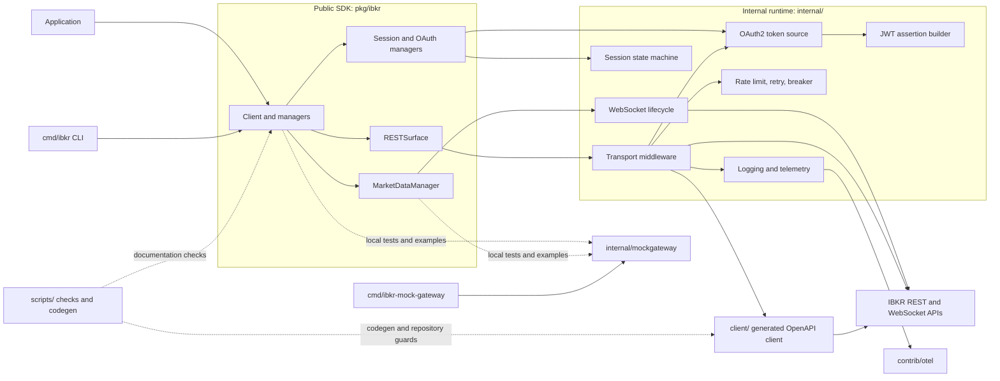

# Architecture

This document describes the runtime shape of `ibkrapi4go` using the GitNexus
knowledge graph for `ibkrapi4go`. It covers the public SDK, generated client,
runtime infrastructure, local mock gateway, observability adapter, and
repository checks.

## Overview

`ibkrapi4go` is a Go SDK for Interactive Brokers' REST and WebSocket APIs.
The public package is `pkg/ibkr`; generated OpenAPI types and the low-level HTTP
client live in `client/`; transport, authentication, session, resilience, and
streaming infrastructure live in `internal/`.

The SDK exposes two API surfaces:

- `/v1/api` with session-based `ssoBearer` authentication.
- `/gw/api/*` with OAuth2 authentication and JWT assertions.

The main design boundaries are:

1. Public managers and `RESTSurface` types remain stable while generated
   OpenAPI types stay behind the `pkg/ibkr` boundary.
2. REST requests pass through a composable `http.RoundTripper` chain for auth,
   telemetry, circuit breaking, retries, rate limiting, and timeouts.
3. WebSocket connections own their lifecycle, read loop, reconnect logic, and
   subscription snapshot/resend behavior.
4. Money and quantity values remain strings or `json.Number`; they are never
   converted to `float64` in the public model.
5. Order mutations are not automatically retried.

## Knowledge-graph snapshot

The graph was read from these resources:

- `gitnexus://repo/ibkrapi4go/context`
- `gitnexus://repo/ibkrapi4go/clusters`
- `gitnexus://repo/ibkrapi4go/processes`
- Five representative process traces listed under [Key execution flows](#key-execution-flows).

| Metric | Value |
|--------|-------|
| Indexed files | 313 |
| Indexed symbols | 6,037 |
| Indexed processes | 520 |
| Functional clusters | 9 |
| Index commit | `6abc7b0` |
| Index freshness at read time | One commit behind `HEAD` |

The index lag is documentation-only at the time of generation: the newer
`b2e0a70` commit adds agent guidance files, not runtime symbols. Re-index with
`node .gitnexus/run.cjs analyze --index-only` before relying on the graph for
future code-impact decisions.

## Functional areas

The graph's Leiden clusters provide the following functional map. Symbol counts
are the counts reported by the graph cluster resources.

| Cluster | Symbols | Cohesion | Responsibility |
|---------|---------|----------|----------------|
| `Ibkr` | 605 | 81% | Public `pkg/ibkr` SDK, managers, client lifecycle, and the `cmd/ibkr` command surface. |
| `Internal` | 330 | 73% | Transport middleware, session state, OAuth/JWT, retries, rate limiting, circuit breaking, observability, and WebSocket runtime. |
| `Mockgateway` | 92 | 76% | In-process REST, OAuth, CPAPI, and WebSocket fixtures/scenarios used by tests and examples. |
| `Scripts` | 29 | 100% | Code generation, documentation checks, money checks, spec checks, and benchmark comparison. |
| `Otel` | 18 | 91% | Optional OpenTelemetry metrics and tracing adapters under `contrib/otel`. |
| `Ibkr-mock-gateway` | 10 | 82% | Standalone mock-gateway command, TLS setup, scenario configuration, and runtime options. |
| `Seed-discussions` | 6 | 100% | Repository discussion-seeding utility. |
| `Check_design` | 6 | 100% | Design-document consistency checks for transport order and manager counts. |
| `Middleware` | 5 | 89% | `http.RoundTripper` middleware examples, fakes, and contract tests. |

## System diagram



## Key execution flows

The process resource is dominated by several variants of the WebSocket
`Subscribe` flow. The following five representative high-step,
cross-community processes cover connection establishment, subscription
replay, authentication, and request throttling. The graph also exposes
`Subscribe → AfterFunc`, `CreateBrowserSession → SignJWT`, and
`ListAvailable → SignJWT` as related variants.

### 1. WebSocket connection and reconnect

**Process:** `Subscribe → DialWS`
**Files:** `pkg/ibkr/ws.go`, `internal/ws.go`

```text
Subscribe
  → ensureWS
  → DialWS
  → wgDoneWrapper
  → readLoop
  → reconnect
  → dial
  → DialWS
```

`MarketDataManager.Subscribe` enters the public WebSocket surface. The
internal connection owns the dial/read-loop lifecycle and can reconnect after
a peer or network failure. The scheduled `Subscribe → AfterFunc` variant adds
the clock callback used to schedule reconnect work.

### 2. Subscription resend after reconnect

**Process:** `Subscribe → Send`
**Files:** `pkg/ibkr/ws.go`, `internal/ws.go`

```text
Subscribe
  → ensureWS
  → DialWS
  → wgDoneWrapper
  → readLoop
  → reconnect
  → resubscribeAll
  → send
```

After reconnect, the connection snapshots active subscriptions and sends them
again. This keeps the public subscription handle independent of individual
socket instances while ensuring updates resume on the new connection.

### 3. Reconnect subscription snapshot

**Process:** `Subscribe → SnapshotSubs`
**Files:** `pkg/ibkr/ws.go`, `internal/ws.go`

```text
Subscribe
  → ensureWS
  → DialWS
  → wgDoneWrapper
  → readLoop
  → reconnect
  → notifyReconnect
  → snapshotSubs
```

The snapshot step preserves the current subscription set before replay. It is
the boundary between the public manager's logical subscription and the
connection-specific wire state.

### 4. Session creation and OAuth2 JWT assertion

**Process:** `CreateSession → SignJWT`
**Files:** `pkg/ibkr/rest_sso.go`, `pkg/ibkr/rest.go`, `internal/oauth.go`, `internal/jwt.go`

```text
CreateSession
  → Token
  → Token (internal/oauth.go)
  → fetch
  → fetchWithJWTAssertion
  → BuildJWTAssertion
  → signJWT
```

The SSO surface obtains an OAuth token through the internal token source. For
the OAuth2 surface, the token source builds and signs a private-key JWT
assertion before calling the token endpoint. `CreateBrowserSession` and
trade-confirmation flows share the same JWT-signing tail.

### 5. Endpoint-aware rate limiting

**Process:** `RateLimit → IsDynamicSegment`
**Files:** `internal/ratelimit.go`

```text
RateLimit
  → Wait
  → needsWait
  → endpoint
  → EndpointKey
  → normalizePath
  → isDynamicSegment
```

The limiter normalizes a request path into an endpoint key and distinguishes
dynamic path segments from fixed endpoint segments. This supports separate
per-endpoint buckets while retaining a global request budget.

## Layering and package responsibilities

```text
pkg/ibkr/          Public API: Client, managers, options, errors
      │
      ▼
internal/          Transport, session, OAuth, rate limits, retry, WebSocket
      │
      ▼
client/            Generated OpenAPI types and HTTP client (DO NOT EDIT)
```

- `pkg/ibkr/client.go` owns public client construction, options, accessors, and
  shutdown.
- `pkg/ibkr/rest*.go` and manager files adapt generated requests/responses into
  stable public types.
- `internal/transport.go` builds the request middleware chain.
- `internal/session.go` implements the session state machine and tickle loop.
- `internal/oauth.go` and `internal/jwt.go` implement OAuth token acquisition
  and JWT assertions.
- `internal/ratelimit.go`, `retry.go`, and `breaker.go` implement safe request
  resilience. Order mutations remain outside automatic retry.
- `internal/ws.go` owns WebSocket dialing, reads, reconnect, and subscription
  replay.
- `client/*.gen.go` is generated from the patched OpenAPI specification and is
  never edited by hand.

## Client lifecycle

```text
NewClient(options...)
   │
   ▼
SessionManager.Initialize(ctx)   → tickle goroutine starts
   │
   ▼
Manager calls (Account, Portfolio, Trade, MarketData)
   │
   ▼
Client.Close()                   → tickle stops, logout, WebSocket closes
```

## REST transport

All REST requests flow through a `http.RoundTripper` chain:

```text
Request
  → request ID and User-Agent
  → bearer authentication
  → logging and telemetry hooks
  → optional circuit breaker
  → safe-method retry and Retry-After handling
  → per-endpoint rate limiter
  → global rate limiter
  → per-request timeout
  → generated HTTP client
  → IBKR error-envelope decoding
Response
```

Authentication, resilience, and observability are internal concerns. Manager
callers receive public SDK errors and response types rather than generated
client types.

## Local development and verification

`internal/mockgateway` provides protocol-compatible local REST, OAuth, CPAPI,
and WebSocket behavior. It supports deterministic fixtures, scenarios, latency,
authentication requirements, and connection recording. The standalone
`cmd/ibkr-mock-gateway` binary exposes the same gateway for examples and manual
testing.

The repository checks are separate from the runtime path:

- `scripts/patch_spec.py` and `scripts/validate_codegen.sh` keep generated
  clients reproducible.
- `scripts/check_money.py` enforces the numeric-precision ADR.
- `scripts/check_links.py` and `scripts/check_i18n.py` validate documentation.
- `scripts/check_design` checks the documented transport order and manager
  counts.
- `scripts/bench_compare.go` compares benchmark output with the checked-in
  baseline.
- `contrib/otel` supplies optional metrics and tracing implementations without
  making the SDK depend on an observability framework.

## Dependencies

| Dependency | Purpose |
|------------|---------|
| `github.com/coder/websocket` | Context-aware WebSocket client |
| `golang.org/x/time/rate` | Token-bucket rate limiting |
| `github.com/oapi-codegen/runtime` | Generated-client runtime helpers |
| `go.uber.org/goleak` | Test-only goroutine leak detection |
| `oapi-codegen` | Build-time OpenAPI code generation |

There are no web or dependency-injection frameworks. New dependencies require
an ADR.

## Design records

See [ADR 0001](./adr/0001-two-api-surfaces.md) for the two API surfaces,
[ADR 0008](./adr/0008-numeric-precision.md) for numeric precision,
[ADR 0009](./adr/0009-no-auto-retry-orders.md) for mutation retries, and
[ADR 0011](./adr/0011-oauth2-surface.md) for OAuth2. Additional implementation
contracts live in [design/](./design/) and operational guidance lives in
[TESTING.md](./TESTING.md), [STREAMING.md](./STREAMING.md), and
[SESSIONS.md](./SESSIONS.md).
