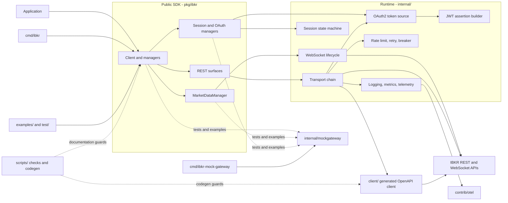

# Architecture

This document describes the runtime shape of `ibkrapi4go`, derived from the
GitNexus knowledge graph. It covers the public SDK, generated client, runtime
infrastructure, local mock gateway, observability adapter, and repository
checks.

## Overview

`ibkrapi4go` is a Go SDK for Interactive Brokers' REST and WebSocket APIs. The
public package is `pkg/ibkr`; generated OpenAPI types and the low-level HTTP
client live in `client/`; transport, authentication, session, resilience, and
streaming infrastructure live in `internal/`.

The SDK exposes two API surfaces:

- `/v1/api` with session-based `ssoBearer` authentication.
- `/gw/api/*` with OAuth2 authentication and JWT assertions.

The main design boundaries are:

1. Public managers and `RESTSurface` types remain stable while generated
   OpenAPI types stay behind the `pkg/ibkr` boundary.
2. REST requests pass through a composable `http.RoundTripper` chain for auth,
   telemetry, circuit breaking, retries, rate limiting, and timeouts.
3. WebSocket connections own their lifecycle, read loop, reconnect logic, and
   subscription snapshot/resend behavior.
4. Money and quantity values remain strings or `json.Number`; they are never
   converted to `float64` in the public model.
5. Order mutations are not automatically retried.

## Knowledge-graph snapshot

The graph was read from these resources. The MCP resource reader was unusable
in the generating session (its LadybugDB storage engine is v40 while the
analyzer writes v42), so every read below was taken through the documented CLI
fallback, `gitnexus cypher -r ibkrapi4go`, against the same index.

- `gitnexus://repo/ibkrapi4go/context`
- `gitnexus://repo/ibkrapi4go/clusters`
- `gitnexus://repo/ibkrapi4go/processes`
- Five representative process traces listed under
  [Key execution flows](#key-execution-flows)

| Metric | Value |
|--------|-------|
| Indexed files | 314 |
| Indexed symbols | 6,055 |
| Execution flows | 522 |
| Functional clusters | 135 |
| Index commit | `df4e0b8` (matches `HEAD`) |

### Known graph limitations

These bound what the clusters and flows below can claim:

- **Full-text search is disabled.** The LadybugDB FTS extension could not load
  on this host (Windows error 126, missing runtime DLL), so BM25/vector ranking
  is unavailable. Cluster and process selection here is structural, not
  semantic.
- **`client/client.gen.go` is not indexed.** It exceeds the 512 KB analyzer cap.
  The generated layer is therefore absent from every cluster and flow below.
- **Flow discovery is truncated.** The analyzer reports 522 flows while
  reporting 313 candidate entry points never ranked, 169 deduplicated flows
  dropped at `maxProcesses`, and 1,245 callees skipped at `maxBranching`. An
  absent flow does not mean the code path does not exist.
- **`heuristicLabel` is not meaningful for this codebase.** The labels collapse
  to `Ibkr` / `Internal` / `Mockgateway` because the graph is derived from Go
  package names. Functional areas below are therefore named from actual cluster
  membership, not from graph labels.

Re-index with `gitnexus analyze --index-only --force` before relying on the
graph for code-impact decisions.

## Functional areas

Areas are the largest Leiden clusters, named from their member files rather
than from the graph's degenerate labels. Symbol counts are the graph's own
`members` counts for that cluster.

| Area | Symbols | Dominant files | Responsibility |
|------|---------|----------------|----------------|
| Public SDK surface | 117 | `pkg/ibkr/trade.go`, `marketdata.go`, `portfolio.go`, `account.go`, `contract.go`, `scanner.go`, `alerts.go` | Public managers, request/response types, and the domain model behind the stability contract. |
| REST adapters | 90 | `pkg/ibkr/rest*.go`, `client.go`, `internal/observability.go` | Generated-client adaptation, REST surfaces, and response decoding. |
| Client and managers | 62 | `pkg/ibkr/client.go`, `ws.go`, `pagination.go`, `trade.go` plus example and integration callers | Client construction, manager wiring, and the public call surface consumed by `cmd/`, `examples/`, and `test/`. |
| Mock gateway and E2E | 57 | `internal/mockgateway/*`, `pkg/ibkr/*_test.go`, `examples/multi-account` | In-process gateway, fault injection, multi-client and end-to-end coverage. |
| Transport and resilience | 33 | `internal/ratelimit.go`, `retry.go`, `breaker.go`, `session.go`, `pkg/ibkr/transport_pool.go` | RoundTripper chain, per-endpoint and global limiting, safe-method retry, circuit breaking, session state. |
| WebSocket runtime | 33 | `internal/ws.go`, `internal/metrics.go`, `internal/mockgateway/stream.go` | Dial, read/write loops, heartbeat, sequence tracking, reconnect, and subscription replay. |
| HTTP transport core | 31 | `internal/transport.go` | Middleware assembly, response-size bounds, timeout/body cancellation, error-envelope decoding. |
| Session state | 29 | `internal/session.go` | Session lifecycle, tickle loop, and state transitions. |
| CLI | 23 | `cmd/ibkr/*.go` | `run` dispatch, config loading, and the accounts/orders/positions/portfolio/stream commands. |
| OAuth2 surface | 19 | `pkg/ibkr/oauth.go`, `internal/oauth.go`, `internal/jwt.go` | Token acquisition, single-flight refresh, rotation, and JWT assertion signing. |

## System diagram



### Measured coupling into `internal/`

Cross-area `CALLS` edges from `pkg/ibkr` into `internal/`, by target file. The
distribution shows that observability and error mapping dominate the public
package's use of the runtime, not transport:

| Target | Calls |
|--------|------:|
| `internal/observability.go` | 193 |
| `internal/errors.go` | 60 |
| `internal/ws.go` | 17 |
| `internal/mockgateway/stream.go` | 7 |
| `internal/transport.go` | 7 |
| `internal/oauth.go` | 7 |
| `internal/ratelimit.go` | 6 |
| `internal/metrics.go` | 4 |
| `internal/session.go` | 4 |
| `internal/breaker.go` | 3 |
| `internal/retry.go` | 3 |

The reverse direction is the public call surface. Non-`pkg/ibkr` callers of
`pkg/ibkr`, by call count: `internal/benchmark_test.go` (39),
`examples/live/oauth2-flow.go` (30), `examples/mock-error-handling/main.go` (26),
`test/integration_test.go` (20), `examples/orders/main.go` (19), and the
remaining example and `cmd/ibkr` entry points.

## Key execution flows

The 522 discovered flows are dominated by terminal-to-terminal variants that
share an entry point. The five below are the most architecturally distinct:
connection establishment, subscription replay, token acquisition, request
throttling, and REST error mapping.

### 1. WebSocket connection establishment

**Process:** `Subscribe → DialWS` (8 steps)
**Files:** `pkg/ibkr/ws.go`, `internal/ws.go`

```text
Subscribe
  -> ensureWS
  -> DialWS
  -> wgDoneWrapper
  -> readLoop
  -> reconnect
  -> dial
  -> DialWS
```

`MarketDataManager.Subscribe` enters the public WebSocket surface.
`ensureWS` establishes the connection on first use; the internal connection then
owns the dial, read, and write loops for its lifetime. The scheduled
`Subscribe → AfterFunc` variant adds the clock callback that schedules reconnect
work after a failure.

### 2. Subscription replay after reconnect

**Process:** `Subscribe → Send` (8 steps)
**Files:** `pkg/ibkr/ws.go`, `internal/ws.go`

```text
Subscribe
  -> ensureWS
  -> DialWS
  -> wgDoneWrapper
  -> readLoop
  -> reconnect
  -> resubscribeAll
  -> send
```

After a successful reconnect, `resubscribeAll` snapshots the active
subscription set and re-sends it with fresh request ids. This is what keeps the
public `Subscription` handle independent of any individual socket instance.
The `Subscribe → SnapshotSubs` variant stops at the snapshot step and marks the
boundary between the manager's logical subscription and connection-specific
wire state.

### 3. Session creation and OAuth2 JWT assertion

**Process:** `CreateSession → SignJWT` (7 steps)
**Files:** `pkg/ibkr/rest_sso.go`, `pkg/ibkr/rest.go`, `internal/oauth.go`,
`internal/jwt.go`

```text
CreateSession
  -> Token              (pkg/ibkr/rest.go)
  -> Token              (internal/oauth.go)
  -> fetch
  -> fetchWithJWTAssertion
  -> BuildJWTAssertion
  -> signJWT
```

The SSO surface obtains an OAuth token through the internal token source. For
the OAuth2 surface, the token source builds and signs a private-key JWT
assertion before calling the token endpoint. `CreateBrowserSession` and
`ListAvailable` share the same JWT-signing tail, reaching it through `NewJTI`,
`JwtClaims`, and `NowFunc`.

### 4. Endpoint-aware rate limiting

**Process:** `RateLimit → IsDynamicSegment` (7 steps)
**Files:** `internal/ratelimit.go`

```text
RateLimit
  -> Wait
  -> needsWait
  -> endpoint
  -> EndpointKey
  -> normalizePath
  -> isDynamicSegment
```

The limiter normalizes a request path into an endpoint key and separates dynamic
path segments from fixed ones, which supports independent per-endpoint buckets
alongside a global request budget. `RateLimit → SweepLocked` covers the cleanup
path for expired buckets.

### 5. REST error mapping

**Process:** `AllAlerts → SentinelByName` (5 steps)
**Files:** `pkg/ibkr/alerts.go`, `pkg/ibkr/response.go`, `pkg/ibkr/client.go`,
`internal/transport.go`

```text
AllAlerts
  -> netDo
  -> errorFrom
  -> ResponseError
  -> sentinelByName
```

Every REST manager funnels through `netDo`. The transport layer decodes IBKR's
error envelope into a `ResponseError`, `errorFrom` attaches it to the public
result, and `sentinelByName` maps broker error names onto exported sentinel
errors so callers can use `errors.Is`. This five-step shape is shared by the
entire REST surface, not just alerts.

## Layering and package responsibilities

```text
pkg/ibkr/          Public API: Client, managers, options, errors
      |
      v
internal/          Transport, session, OAuth, rate limits, retry, WebSocket
      |
      v
client/            Generated OpenAPI types and HTTP client (DO NOT EDIT)
```

- `pkg/ibkr/client.go` owns public client construction, options, accessors, and
  shutdown.
- `pkg/ibkr/rest*.go` and manager files adapt generated requests and responses
  into stable public types.
- `internal/transport.go` builds the request middleware chain.
- `internal/session.go` implements the session state machine and tickle loop.
- `internal/oauth.go` and `internal/jwt.go` implement OAuth token acquisition
  and JWT assertions.
- `internal/ratelimit.go`, `retry.go`, and `breaker.go` implement safe request
  resilience. Order mutations remain outside automatic retry.
- `internal/ws.go` owns WebSocket dialing, reads, reconnect, and subscription
  replay.
- `client/*.gen.go` is generated from the patched OpenAPI specification and is
  never edited by hand.

## Client lifecycle

```text
NewClient(options...)
   |
   v
SessionManager.Initialize(ctx)   -> tickle goroutine starts
   |
   v
Manager calls (Account, Portfolio, Trade, MarketData)
   |
   v
Client.Close()                   -> WebSocket closes first,
                                   then release/tickle stop and logout
```

`Close` swaps a closed flag so it is idempotent, tears down the WebSocket
connection before session release, and only then performs the bounded logout.
After `Close`, manager methods return `ErrClosed`.

## REST transport

All REST requests flow through a `http.RoundTripper` chain:

```text
Request
  -> request ID and User-Agent
  -> bearer authentication
  -> logging and telemetry hooks
  -> Instrument
  -> optional circuit breaker
  -> safe-method retry and Retry-After handling
  -> rate limiter (per-endpoint and global buckets)
  -> per-request timeout
  -> response-size bound
  -> error-envelope decoding
  -> user middleware
  -> generated HTTP client
Response
```

Authentication, resilience, and observability are internal concerns. Manager
callers receive public SDK errors and response types rather than generated
client types.

## Local development and verification

`internal/mockgateway` provides protocol-compatible local REST, OAuth, CPAPI,
and WebSocket behavior. It supports deterministic fixtures, scenarios, latency,
authentication requirements, and connection recording. The standalone
`cmd/ibkr-mock-gateway` binary exposes the same gateway for examples and manual
testing.

The repository checks are separate from the runtime path:

- `scripts/patch_spec.py` and `scripts/validate_codegen.sh` keep generated
  clients reproducible.
- `scripts/check_money.py` enforces the numeric-precision ADR and carries its own
  seeded-field self-test.
- `scripts/check_links.py` and `scripts/check_i18n.py` validate documentation.
- `scripts/check_design` verifies that the middleware chain diagram in
  `docs/design/01-transport.md` lists the expected layers in the expected
  relative order, checks documented manager counts, and diffs the diagram
  against the middleware that `internal.NewClientTransport` actually assembles.
  Reordering or adding a middleware in the code without updating the diagram
  fails the check.
- `scripts/bench_compare.go` compares benchmark output with the checked-in
  baseline.
- `contrib/otel` supplies optional metrics and tracing implementations without
  making the SDK depend on an observability framework.

## Dependencies

| Dependency | Purpose |
|------------|---------|
| `github.com/coder/websocket` | Context-aware WebSocket client |
| `golang.org/x/time/rate` | Token-bucket rate limiting |
| `github.com/oapi-codegen/runtime` | Generated-client runtime helpers |
| `go.uber.org/goleak` | Test-only goroutine leak detection |
| `oapi-codegen` | Build-time OpenAPI code generation |

There are no web or dependency-injection frameworks. New dependencies require
an ADR.

## Design records

See [ADR 0001](./adr/0001-two-api-surfaces.md) for the two API surfaces,
[ADR 0008](./adr/0008-numeric-precision.md) for numeric precision,
[ADR 0009](./adr/0009-no-auto-retry-orders.md) for mutation retries, and
[ADR 0011](./adr/0011-oauth2-surface.md) for OAuth2. Additional implementation
contracts live in [design/](./design/) and operational guidance lives in
[TESTING.md](./TESTING.md), [STREAMING.md](./STREAMING.md), and
[SESSIONS.md](./SESSIONS.md).
